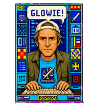

# Terry — a Codex pet

A small, fan-made tribute to Terry A. Davis: hunched over the keyboard, framed by the real visual language of TempleOS, and occasionally checking what is happening just outside the camera.



## Install

Create a `terry` folder inside your Codex pets directory and copy `pet.json` and `spritesheet.webp` into it.

On Windows, the destination is usually:

```text
%USERPROFILE%\.codex\pets\terry\
```

On macOS or Linux:

```text
~/.codex/pets/terry/
```

Restart Codex if the pet does not appear immediately.

## Files

- `pet.json` — pet metadata
- `spritesheet.webp` — the complete v2 animation atlas
- `preview.gif` — an animation-loop preview; Codex does not need this file

The atlas uses 192 × 208 pixel cells in an 8 × 11 grid and includes the standard animation states plus all 16 look directions. Every occupied cell uses the same rigid 182 × 198 viewport with five-pixel margins, so the pet never changes width between frames.

The surrounding desktop was grounded in the [official TempleOS site](https://templeos.org/), the official TempleOS header artwork, and public-domain TempleOS 5.03 screenshots from [Wikimedia Commons](https://commons.wikimedia.org/wiki/Category:TempleOS). The UI panes, top status line, 16-color text accents, icons, and sword-and-scales imagery are treated as part of Terry's fixed webcam frame.

The talkative loops keep the connected `#@!%` bubble visible throughout the six-frame working animation and `GLOWIE!` throughout the six-frame review animation.

## Two versions

The root files are the talkative `terry` build with the comic outbursts. A quieter historical build is preserved under `variants/terry-watchful`; it has no speech bubbles and occasionally looks off to the side.

To keep both installed, use two separate pet folders:

```text
%USERPROFILE%\.codex\pets\terry\
%USERPROFILE%\.codex\pets\terry-watchful\
```

Copy the root `pet.json` and `spritesheet.webp` into the first folder, then copy the matching files from `variants/terry-watchful` into the second.

## Note

This is an unofficial fan work made in appreciation of Terry and TempleOS. It is not affiliated with or endorsed by Terry's estate, the TempleOS project, or OpenAI.

The artwork was made with AI-assisted image tools and finished through an iterative, human-directed spritesheet and QA process.
